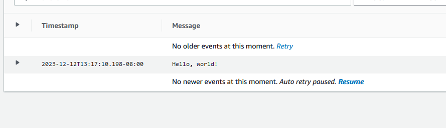

# espresso-technical-challenge-tf

Following best practice in keeping this seperate from application code.

- [x] Create a public Github repo for this project
    - please see: https://github.com/nyanbinaryneko/espresso-technical-challenge
- [x] Write a "Hello World" program in Rust
- [x] Using Github Actions
- [x] Build your "Hello World" Rust program into an executable binary
- [x] Build a Docker container that runs your rust binary
- [x] Push the container image to the Github container registry
- [x] Write Terraform to run that container image in a "cloud" environment

Proof of running:
